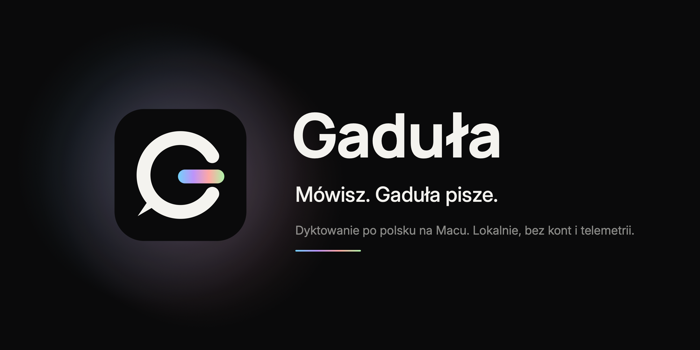

<p align="center">
  
</p>

<p align="center">
  <a href="https://github.com/arturwywijas/gadula/releases/latest"><b>Pobierz Gadułę 0.2.0</b></a>
  &nbsp;·&nbsp; macOS 14 lub nowszy &nbsp;·&nbsp; Apple Silicon &nbsp;·&nbsp; licencja MIT
</p>

Gaduła to mała, darmowa aplikacja w pasku menu Maca do dyktowania po polsku. Wciskasz skrót, mówisz, a tekst trafia do pola, w którym piszesz. Jeśli nie da się go wkleić, czeka w schowku. Mowa jest rozpoznawana na Twoim Macu.

## Co potrafi

- Dyktowanie po polsku w aktywnej aplikacji, uruchamiane domyślnie skrótem **Option+Space**. Gdy tekst się nie wklei, możesz użyć **Cmd-V**.
- Dwa tryby: **przełącznik** (wciśnij, mów, wciśnij) albo **przytrzymanie** (trzymaj, mów, puść).
- Własny skrót, w tym Fn na klawiaturze Apple.
- Lokalne rozpoznawanie mowy przez WhisperKit, do wyboru modele **large-v3-turbo** i **small**.
- Samodzielne wklejanie tekstu, a gdy to niemożliwe, tekst w schowku i podpowiedź w menu.
- Wskaźnik nagrywania na dole ekranu w trzech stylach: Iskry, Słupki i Nić światła.
- Żółty wskaźnik przygotowania i zielony **Możesz mówić**, gdy mikrofon już przekazuje dźwięk.
- Pozycja **Słownik nazw…** w menu aplikacji oraz opcjonalne akapity i komendy formatowania w **Tekst**.
- Rozpoznawanie zakończonych fragmentów podczas dyktowania, jeśli wypowiedź zawiera pauzy.
- **Escape** anuluje nagranie bez wstawiania tekstu; w innych aplikacjach wymaga Dostępności.

## Instalacja

1. Pobierz `Gadula-0.2.0.dmg` z [najnowszego wydania](https://github.com/arturwywijas/gadula/releases/latest).
2. Otwórz obraz dysku, przeciągnij **Gaduła.app** do folderu **Aplikacje**, a potem wysuń obraz.
3. Uruchom Gadułę. Ikona pojawi się w pasku menu, a model rozpoznawania mowy pobierze się w tle. Postęp widać w menu **Model**.
4. Przy pierwszym nagraniu zezwól na użycie mikrofonu. Żeby tekst wklejał się sam, włącz Gadułę w **Ustawieniach systemowych → Prywatność i ochrona → Dostępność**.
5. Kliknij w pole tekstowe, wciśnij **Option+Space**, poczekaj na zielone **Możesz mówić**, podyktuj tekst i wciśnij skrót jeszcze raz.

## Prywatność

Gaduła nie ma kont ani telemetrii. Mowę rozpoznaje lokalnie, a w kodzie nie ma ścieżki, którą nagrany dźwięk mógłby trafić do usługi rozpoznawania mowy.

Internet jest potrzebny na start: model, tokenizer i konfiguracja pobierają się z Hugging Face przy pierwszym użyciu, przy zmianie modelu albo ponownym pobieraniu. Praca bez sieci wymaga wcześniej pobranych wszystkich tych zasobów. Pełnego ruchu sieciowego aplikacji nie mierzyłem.

## O co zapyta Mac

| Uprawnienie | Po co |
|---|---|
| Mikrofon | Nagrywanie głosu. System zapyta przy pierwszej próbie nagrania. |
| Dostępność | Wklejanie tekstu skrótem Cmd-V oraz globalny nasłuch Fn i Escape. Bez niej tekst zostaje w schowku. |

Wybór mikrofonu w menu Gaduły zmienia domyślne wejście dźwięku dla całego Maca.

## Czego jeszcze nie sprawdziłem

- Na samym macOS 14 Gaduła nie była testowana. To minimum zadeklarowane w projekcie.
- Nie sprawdziłem, czy opcja **Uruchamiaj przy logowaniu** działa po ponownym zalogowaniu.
- Wklejania nie sprawdziłem w każdym programie, w którym da się pisać.
- Wersję 0.2.0 porównano na małym zestawie syntetycznej mowy polskiej. To nie jest pomiar dokładności na głosie użytkownika: [wyniki i ograniczenia](docs/DYKTOWANIE-0.2.0.md).
- Macy z procesorem Intel nie są obsługiwane: plik zawiera tylko wersję arm64.

## Czy to na pewno ten plik

Status podpisu Developer ID, notaryzacji Apple oraz plik z sumą SHA-256 znajdziesz przy [najnowszym wydaniu](https://github.com/arturwywijas/gadula/releases/latest). Suma dotyczy konkretnego pliku DMG.

```sh
shasum -a 256 ~/Downloads/Gadula-0.2.0.dmg
spctl --assess --type open --context context:primary-signature ~/Downloads/Gadula-0.2.0.dmg
```

## Dokumentacja

- [Jak działa Gaduła](docs/UZYCIE.md): skróty i tryby, uprawnienia, wklejanie, przetwarzanie dźwięku, modele, podpis wydania.
- [Budowanie ze źródeł](docs/BUILDING.md): toolchain, testy, składanie aplikacji i obrazu dysku. Samodzielnie zbudowana kopia nie jest notaryzowana.

## Licencja

Kod Gaduły jest dostępny na licencji [MIT](LICENSE), Copyright (c) 2026 Artur Wywijas. [Noty oprogramowania osób trzecich](THIRD-PARTY-NOTICES.md) obejmują dictly, WhisperKit i swift-transformers; znajdziesz je też w aplikacji: **O aplikacji → Licencje**.

Autor: [Artur Wywijas](https://arturwywijas.pl)
